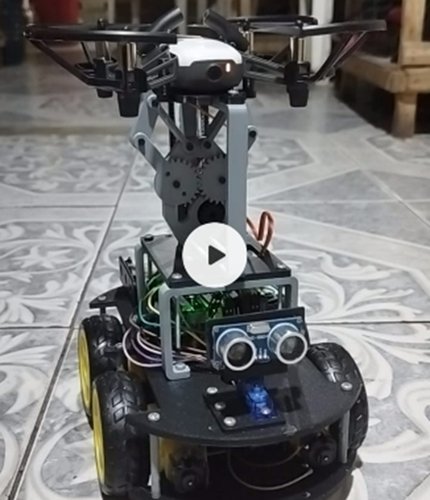
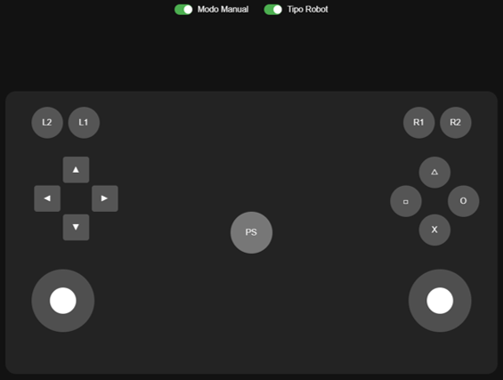

# 🚒 Vehículos Autónomos de Nivel 2 para la Prevención y Control de Incendios
**Descripción:** Un sistema avanzado que combina un carro robótico y un dron para la detección temprana, monitoreo y control de incendios, optimizando las operaciones de respuesta y mejorando la seguridad en zonas de riesgo.

## 📌 Introducción

### 🔥 Descripción de la Problemática
Los incendios representan una amenaza crítica tanto en entornos urbanos como forestales. La detección tardía y la dificultad de acceso a zonas de riesgo aumentan la gravedad de los incidentes, poniendo en peligro vidas humanas y causando pérdidas materiales significativas. La intervención de bomberos en condiciones extremas también conlleva un alto nivel de riesgo.

### 🎯 Justificación
Implementar un sistema de vehículos autónomos de nivel 2 que colabore con los equipos de emergencia puede optimizar la detección y mitigación de incendios. Este sistema permite reducir la exposición de los rescatistas a zonas peligrosas, mejorar la eficiencia de respuesta y aprovechar tecnologías avanzadas como inteligencia artificial y drones para un monitoreo en tiempo real.

### 🚗 Solución Propuesta
La solución consiste en un sistema integrado por un carro robótico y un dron, que operan en conjunto mediante protocolos de comunicación como UDP y HTTP. Estos vehículos contarán con modos de operación manual y automático, así como una interfaz web para control remoto. Utilizarán algoritmos de inteligencia artificial para detectar focos de incendio y asistir en la localización de personas en peligro.

## 🎯 Objetivos

### 🏆 Objetivo General
Desarrollar un sistema de vehículos autónomos nivel 2 para la detección y control de incendios, mejorando la seguridad y eficiencia en operaciones de rescate y mitigación.

### ✅ Objetivos Específicos
- 🛠️ Diseñar y programar un carro robótico con capacidad de navegación autónoma y manual.
- 🚁 Implementar un dron para la detección de incendios mediante sensores y cámaras.
- 🌐 Desarrollar una interfaz web para el control remoto y la visualización en tiempo real.
- 🧠 Integrar algoritmos de inteligencia artificial para mejorar la autonomía y eficiencia en la detección de incendios.
- 🔬 Validar la funcionalidad del sistema mediante pruebas en entornos simulados y controlados.

## 🏗️ Descripción de Componentes
### 🔩 Hardware
- **ESP32**: Microcontrolador principal del carro robótico.
- **Drone DJI Tello**: Vehículo aéreo para monitoreo y detección de incendios.
- **Cámara HD**: Para la detección de incendios.
- **Arduino UNO**: Microcontrolador para gestión de comunicación y control de sensores y actuadores.
- **Shield Driver Motor para Arduino**: Controlador de motores y servomotores.
- **Motores DC y Servomotores SG90**: Movilización del carro y actuación de sensores.
- **Sensor Ultrasónico**: Detección de obstáculos.
- **Impresión 3D**: Estructura mecánica del carro robótico.
- **Baterías LiPo (3.7V 2500mAh)**: Fuente de alimentación.

### 💻 Software
- **Protocolo de comunicación UDP y HTTP**
- **Interfaz Web (HTML, CSS, JavaScript)**
- **Algoritmos de Inteligencia Artificial (YOLO)**

## 🛠️ Configuración del Entorno

### 📦 Instalación de Librerías
Para compilar y ejecutar los códigos en la ESP32 y el Arduino UNO, se deben instalar las siguientes librerías en el IDE de Arduino:

#### **🖥️ Para el Carro Robótico (Arduino UNO)**
- [AFMotor](https://github.com/adafruit/Adafruit-Motor-Shield-library) - Controlador de motores.
- [Servo](https://www.arduino.cc/en/reference/servo) - Manejo de servomotores.
- [SoftwareSerial](https://www.arduino.cc/en/Reference/softwareSerial) - Comunicación serial por software.

#### **🌐 Para la ESP32**
- [WiFi](https://www.arduino.cc/en/Reference/WiFi) - Conectividad inalámbrica.
- [ESPAsyncWebServer](https://github.com/me-no-dev/ESPAsyncWebServer) - Servidor web asincrónico.
- **WiFiUdp** - Comunicación UDP para control del dron DJI Tello.

### 🔍 Consideraciones Importantes
- **ESP32:** Se recomienda usar un conversor USB-TTL para cargar el código en la ESP32.
- **Arduino UNO:** Asegurar la correcta conexión con la ESP32 a través de los pines RX/TX.
- **DJI Tello:** Conectar la ESP32 a la red Wi-Fi del dron antes de iniciar la ejecución del código.
- **Baterías LiPo:** Verificar el estado de carga antes de cada prueba para evitar fallos de energía.

## Trabajos Relacionados

### "Design and Deployment of an Autonomous Unmanned Ground Vehicle for Urban Firefighting Scenarios"
Este estudio aborda el diseño y despliegue de un vehículo autónomo terrestre para escenarios de extinción de incendios urbanos. El vehículo está equipado con un brazo robótico y utiliza sensores a bordo para navegación autónoma y cámaras térmicas para la identificación de fuentes de fuego. Se valida mediante experimentos que demuestran la capacidad del sistema para identificar y extinguir fuentes de calor en edificios.

### "Tello SDK 2.0 User Guide"
Este manual ofrece una guía completa para el uso del SDK 2.0, permitiendo el control del dron DJI Tello a través del protocolo UDP. Proporciona instrucciones para establecer una conexión Wi-Fi entre el Tello y un dispositivo, enviar comandos de texto y recibir respuestas. Esto facilita el control del dron en aplicaciones como la vigilancia de incendios.

## 🏁 Conclusiones
- 🚀 Se desarrolló un sistema de vehículos autónomos nivel 2 capaz de detectar y mitigar incendios.
- 📡 Se logró una comunicación efectiva entre el dron y el carro mediante protocolos UDP y HTTP.
- 🔥 Se recomienda integrar cámaras térmicas para mejorar la detección de incendios.
- 🛸 El SDK 2.0 del dron DJI Tello facilita el control remoto y la automatización, lo que lo convierte en una herramienta útil para la vigilancia de incendios.

## 📎 Enlaces y Recursos
- 🔗 [Repositorio GitHub](https://github.com/vicente-alvarado/Vehiculos-Autonomos-Nivel-2-Drone-Carro-Robot-controlados-por-una-ESP32.git)
- 🔗 [“Design and Deployment of an Autonomous Unmanned Ground Vehicle for Urban Firefighting Scenarios”](https://arxiv.org/abs/2107.03582). arXiv.org. Accedido el 20 de enero de 2025.
- 🔗 [Tello SDK 2.0 User Guide](https://dl-cdn.ryzerobotics.com/downloads/Tello/Tello%20SDK%202.0%20User%20Guide.pdf?). Accedido el 20 de enero de 2025.
